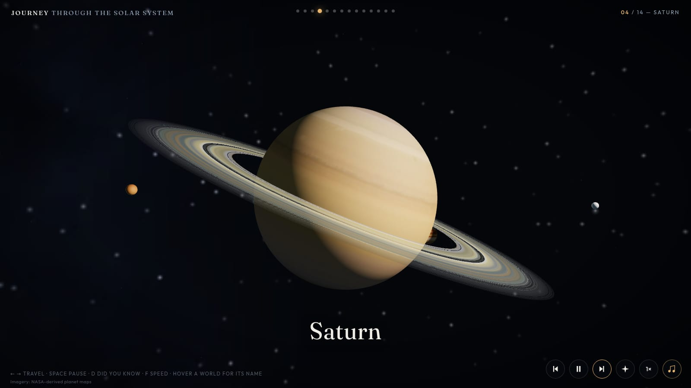

# Journey Through the Solar System

A cinematic WebGL tour from the cold edge of the solar system down to the Sun — fourteen stops, a five-chapter ambient score, and nothing to install. A small static site with no build step and no third-party dependencies.

**[▶ Take the journey](https://yoavbz.github.io/solar-system-journey/)**



## The route

Deep Space → Neptune → Uranus → Saturn → Jupiter → the Asteroid Belt → Mars → Earth & the Moon → Venus → Mercury → the Sun — then three closing scenes: a size comparison of the planets, an orbit map, and a farewell.

Each stop plays out as a slow camera move with film-style captions. Let it run as a guided tour, or take the controls yourself.

## Features

- **Fully self-hosted.** No CDNs, no third-party requests: three.js, the fonts, and the planet maps all live in this repo. The page is interactive in about a second; high-resolution textures stream in behind the procedurally painted planets.
- **A real score, with a living skin.** The journey is scored in five chapters — the cold edge, the giants, the rocky worlds, the Sun, and a quiet epilogue — using space-ambient music by [Stellardrone](https://stellardrone.bandcamp.com/) (CC BY), trimmed and loudness-matched to be heard the way you'll hear it: softly, under starlight. When you reach Earth, a distant piano plays the most famous moon-music ever written — Debussy's *Clair de lune*. On top of the recordings, the site's own Web Audio engine still performs everything a recording can't: the rush of each flight, a two-tone call on every arrival, and a sprinkle of bells when you spot something hidden in the sky — voiced from the key of whatever's playing. Toggle it all with the music button or <kbd>m</kbd>.
- **Still sings with no files at all.** Offline, on `file://`, or with data-saver on, a fully generative score takes over seamlessly — a slow-breathing pad choir, sparse celesta, and a harmony that earns its first major third at Saturn and blooms into a major seventh at the Sun. If you never noticed the swap, it worked.
- **Living scenes.** Storm bands on Jupiter, Saturn's rings with orbiting moons, a dense asteroid belt, city lights on Earth's night side, solar prominences, a passing comet — plus a false-color science view of the Sun.
- **A deep sky.** Thousands of layered stars, the Milky Way with its glowing core and dust lanes, colorful galaxies — one seen edge-on, two colliding — and nebulae where stars are born.
- **Field notes.** An opt-in "Did you know?" layer: three or four curated facts per stop, one at a time, in a quiet card that holds the tour while you read.
- **Free-look.** Drag the sky — mouse or finger — to look around while the camera keeps riding its authored path. The view stays where you point it; travel brings it home. Works at every stop and even mid-flight. And if you spin until the planet slips off-screen, a quiet cue at the frame's edge names it and points the way — tap it (or press <kbd>Esc</kbd>) to glide back.
- **A sky worth turning for.** Moons scattered all around your head at every world, tinted galaxies and painted nebulae off in the dark, star clusters, a breathing variable star, shooting stars for patient watchers, a sungrazer comet at the Sun — all of it nameable with a hover or a tap, and the first held look of a session gets a quiet answer.
- **Made for touch too.** Drag to look, two-finger swipe to travel, tap a world for its name, and a safe-area-aware layout.
- **Accessible by design.** Keyboard navigation throughout, hover any world for its name, and `prefers-reduced-motion` starts the tour paused so visitors move at their own pace.

## Controls

| Input | Action |
|---|---|
| <kbd>→</kbd> / <kbd>←</kbd> | Travel to the next / previous stop |
| <kbd>Space</kbd> | Pause or resume the tour |
| <kbd>d</kbd> | Open the field notes (while open, <kbd>→</kbd>/<kbd>←</kbd> browse facts) |
| <kbd>f</kbd> | Cycle travel speed (1× / 2× / 4×) |
| <kbd>m</kbd> | Toggle music |
| Dots (top center) | Jump to any stop |
| Drag the sky | Look around from where you are — the view is yours until you travel |
| <kbd>Esc</kbd> / edge cue | Bring the world back into view after looking away |
| Mouse hover / tap | Name the world under the cursor or finger |
| Two-finger swipe | Travel between stops (touch screens) |

## Running locally

No build step and no internet needed. Clone the repo and serve the folder:

```sh
python3 -m http.server
# then visit http://localhost:8000
```

(Opening `index.html` straight from the file system mostly works too, but browsers block texture loading from `file://`, so the planets keep their painted procedural looks instead of the photographic maps.)

## Credits

Planet and moon maps by [Solar System Scope](https://www.solarsystemscope.com/textures/) ([CC BY 4.0](https://creativecommons.org/licenses/by/4.0/)), based on NASA imagery. Space Station render by [NASA](https://commons.wikimedia.org/wiki/File:ISS_spacecraft_model_1.png) (public domain). Rendered with [three.js](https://threejs.org/) r128.

Chapter beds by [Stellardrone](https://stellardrone.bandcamp.com/) — *Ethereal*, *The Belt of Orion*, *Pale Blue Dot*, *Journey to the Sun*, *The Edge of Forever* — licensed [CC BY](https://creativecommons.org/licenses/by/3.0/), trimmed and loudness-matched for quiet playback (loop edits by this project). *Clair de lune* by Claude Debussy (public domain), performed by Laurens Goedhart ([CC BY 3.0](https://creativecommons.org/licenses/by/3.0/), via Wikimedia Commons). When the network is away, the music is generated live in your browser — no files, no samples, just math.
